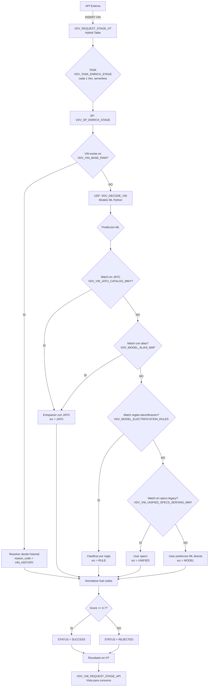
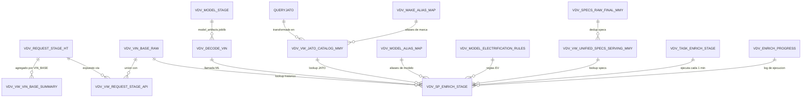
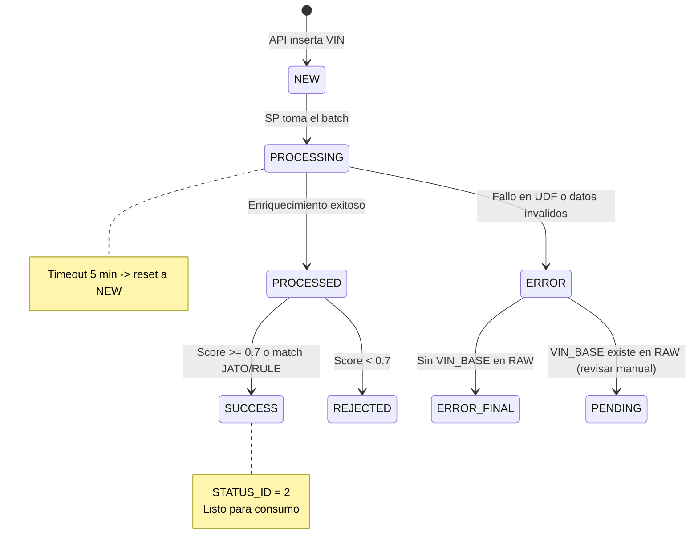
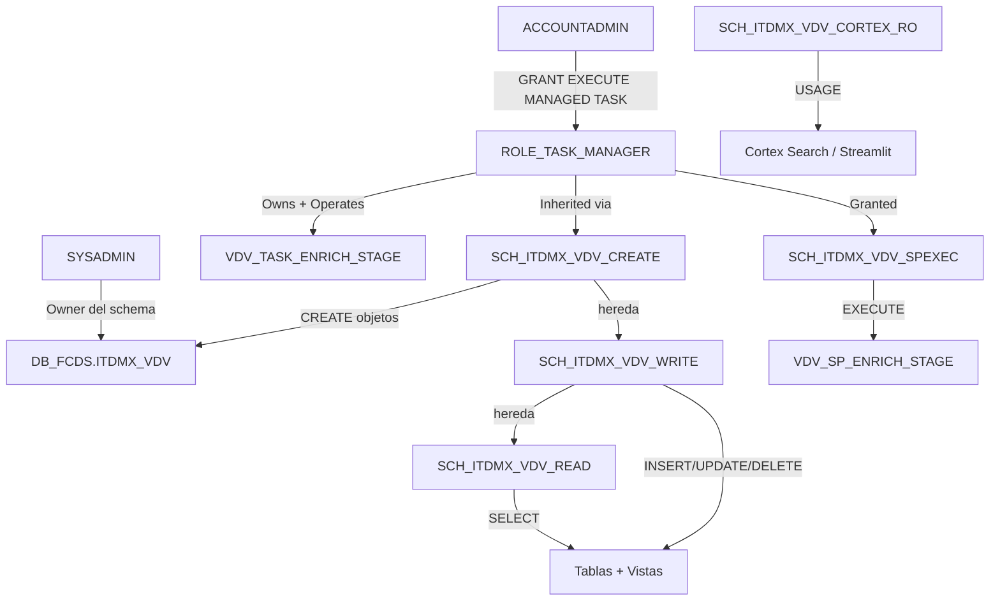

# VDV - Transferencia de Conocimiento

**Proyecto:** VDV (VIN Decode & Vehicle Classification)
**Schema:** `DB_FCDS.ITDMX_VDV`
**Desarrollador:** FLEMUS
**Fecha:** 2026-06-25

---

## 1. Que es VDV y por que existe

VDV es un sistema que recibe numeros VIN (Vehicle Identification Number) o combinaciones Make/Model/Year y los clasifica automaticamente. Determina:

- **Make** (marca del vehiculo, codigo de 4 caracteres)
- **Model** (modelo normalizado, max 25 caracteres)
- **Year** (anio del vehiculo)
- **Fuel Category** (G=gasolina, D=diesel, E=electrico, I=hibrido, etc.)
- **Engine Class Level ID** (nivel de electrificacion: 1=MHEV, 3=HEV, 4=PHEV, 5=BEV, 7=EREV, 8=ICE, 9=N/A)
- **Primary/Secondary Fuel Type Codes**

Antes esto se hacia manual. Ahora una API externa inserta los VINs y un proceso automatico los enriquece cada minuto.

---

## 2. Diagrama de Arquitectura



---

## 3. Diagrama de Objetos y Dependencias



---

## 4. Diagrama de Estados del Request



---

## 5. Tablas - Detalle

### Tablas principales (transaccionales)

| Tabla | Tipo | Filas | Descripcion |
|-------|------|-------|-------------|
| `VDV_REQUEST_STAGE_HT` | Hybrid | Crece | Tabla principal. API inserta, SP enriquece. PK = REQUEST_UUID |
| `VDV_VIN_BASE_RAW` | Standard | ~350K | Historico de flota. Fuente de verdad. PK = VIN |
| `VDV_ENRICH_PROGRESS` | Standard | Crece | Log de cada ejecucion del SP |

### Tablas de referencia (catalogo)

| Tabla | Filas | Quien la mantiene | Descripcion |
|-------|-------|-------------------|-------------|
| `QUERYJATO` | ~2M | Se recarga periodicamente desde CSV | Catalogo JATO vehiculos (marca, modelo, electrificacion) |
| `VDV_SPECS_RAW_FINAL_MMY` | Variable | Carga inicial, rara vez cambia | Specs del sistema legacy |
| `VDV_FUEL_EQUIV_MAP` | 0 | Manual si se necesita | Mapa de equivalencia fuel (no usado activamente) |

### Tablas de configuracion (se editan para ajustar comportamiento)

| Tabla | Filas | Para que se edita |
|-------|-------|-------------------|
| `VDV_MAKE_ALIAS_MAP` | 11 | Agregar cuando ML predice un codigo de marca que JATO no reconoce |
| `VDV_MODEL_ALIAS_MAP` | 26 | Agregar cuando el nombre del modelo tiene variantes (espacios, guiones) |
| `VDV_MODEL_ELECTRIFICATION_RULES` | 16 | Agregar para forzar clasificacion EV por patron de nombre |

---

## 6. Funcion UDF - VDV_DECODE_VIN

| Propiedad | Valor |
|-----------|-------|
| **Nombre** | `VDV_DECODE_VIN(VIN VARCHAR)` |
| **Lenguaje** | Python 3.10 |
| **Retorna** | OBJECT (JSON) |
| **Dependencias** | pandas, numpy, scikit-learn, joblib |
| **Modelo** | `@VDV_MODEL_STAGE/v15/model_artifacts.joblib` |
| **Version actual** | `vin_v15_balanced` |

**Que hace internamente:**
1. Valida que el VIN tenga 17 caracteres
2. Extrae el WMI (primeros 3 caracteres) para lookup de marca
3. Decodifica el anio del caracter 10 (posicion VIN estandar)
4. Usa 3 clasificadores en cascada: make -> model -> engine_class
5. Retorna predicciones con scores de confianza

**Output JSON:**
```json
{
  "error": null,
  "model_version": "vin_v15_balanced",
  "predicted": {"make": "NISS", "model": "SENTRA", "year": 2025},
  "engine_class_pred": "8",
  "scores": {"score_make": 0.95, "score_model": 0.88, "score_global": 0.89},
  "flags": {"vin_len_ok": true, "no_revisar": true}
}
```

**Test rapido:**
```sql
SELECT VDV_DECODE_VIN('3N1CN7AE8SK418788');
```

---

## 7. Vistas

| Vista | Consumida por | Descripcion |
|-------|---------------|-------------|
| `VDV_VW_REQUEST_STAGE_API` | API/Aplicacion | Union de HT + RAW con campo STATUS_REASON legible |
| `VDV_VW_JATO_CATALOG_MMY` | SP (interno) | Catalogo JATO transformado con aliases, dedup por MMY_KEY |
| `VDV_VW_UNIFIED_SPECS_SERVING_MMY` | SP (interno) | Specs deduplicados por MMY_KEY |
| `VDV_VW_VIN_BASE_SUMMARY` | Reporting | Agregado por VIN_BASE: conteos por status |

**Las vistas no almacenan datos.** Si hay un problema en la vista, revisen la tabla fuente.

---

## 8. Stored Procedure - VDV_SP_ENRICH_STAGE

| Propiedad | Valor |
|-----------|-------|
| **Lenguaje** | SQL (Scripting) |
| **Ejecucion** | EXECUTE AS OWNER |
| **Batch size** | 500 filas |
| **Max iteraciones** | 10 por ejecucion |
| **Throughput** | ~5,000 filas/minuto max |

**Flujo del SP:**

1. Reset filas stuck (`PROCESSING` > 5 min) a `NEW`
2. Verificar que no haya otra ejecucion concurrente
3. Si no hay filas `NEW` -> retorna SKIP
4. Loop (max 10 veces):
   - Claim batch de 500 filas (`NEW` -> `PROCESSING`)
   - Calcular VIN_BASE (posiciones 1-8 + 10 del VIN)
   - Buscar match historico en VDV_VIN_BASE_RAW
   - Para los que no matchean: llamar VDV_DECODE_VIN
   - Enriquecer con JATO (match exacto -> alias -> fuzzy prefix)
   - Aplicar reglas de electrificacion
   - Fallback a specs legacy
   - Normalizar fuel codes (texto largo -> codigo 1 char)
   - Asignar status final (SUCCESS/REJECTED/ERROR)
5. Escribir progreso en VDV_ENRICH_PROGRESS

**Test manual:**
```sql
CALL VDV_SP_ENRICH_STAGE();
-- Retorna: {"status":"SKIP","reason":"no_pending_rows"} si no hay pendientes
-- Retorna: {"status":"OK","iterations":N,"processed":X,"errors":Y} si proceso
```

---

## 9. Task

| Propiedad | Valor |
|-----------|-------|
| **Nombre** | `VDV_TASK_ENRICH_STAGE` |
| **Tipo** | Serverless (Snowflake gestiona compute) |
| **Schedule** | Cada 1 minuto |
| **Overlap** | NO_OVERLAP (no ejecuta si la anterior no termino) |
| **Owner** | ROLE_TASK_MANAGER |

**Comandos operativos:**
```sql
-- Suspender
ALTER TASK DB_FCDS.ITDMX_VDV.VDV_TASK_ENRICH_STAGE SUSPEND;

-- Reanudar
ALTER TASK DB_FCDS.ITDMX_VDV.VDV_TASK_ENRICH_STAGE RESUME;

-- Ver estado actual
SHOW TASKS IN SCHEMA DB_FCDS.ITDMX_VDV;

-- Historial ultimas 24h
SELECT name, state, scheduled_time, completed_time,
       DATEDIFF('second', scheduled_time, completed_time) AS duracion_seg,
       error_message, return_value
FROM TABLE(INFORMATION_SCHEMA.TASK_HISTORY(
    TASK_NAME => 'VDV_TASK_ENRICH_STAGE',
    SCHEDULED_TIME_RANGE_START => DATEADD('hour', -24, CURRENT_TIMESTAMP())
))
ORDER BY scheduled_time DESC LIMIT 50;
```

---

## 10. Roles y Permisos



| Role | Que puede hacer |
|------|-----------------|
| `SCH_ITDMX_VDV_READ` | SELECT en tablas y vistas, USAGE en funciones |
| `SCH_ITDMX_VDV_WRITE` | INSERT/UPDATE/DELETE + todo lo de READ |
| `SCH_ITDMX_VDV_CREATE` | Crear objetos + todo lo de WRITE |
| `SCH_ITDMX_VDV_SPEXEC` | Ejecutar stored procedures |
| `SCH_ITDMX_VDV_CORTEX_RO` | Cortex Search y Streamlit |
| `ROLE_TASK_MANAGER` | Opera el task (account-level) |

---

## 11. Escenarios de mantenimiento

### Agregar un alias de marca

Cuando el modelo ML predice una marca (ej: "BYDX") que JATO no reconoce:

```sql
INSERT INTO DB_FCDS.ITDMX_VDV.VDV_MAKE_ALIAS_MAP (MAKE_ML, MAKE_JATO)
VALUES ('BYDX', 'BYD');
```

### Agregar un alias de modelo

Cuando el modelo tiene variantes de nombre:

```sql
INSERT INTO DB_FCDS.ITDMX_VDV.VDV_MODEL_ALIAS_MAP (MAKE, MODEL_ML, MODEL_JATO)
VALUES ('TOYO', 'RAV 4', 'RAV4');
```

### Agregar una regla de electrificacion

Para forzar que ciertos modelos se clasifiquen como electricos:

```sql
INSERT INTO DB_FCDS.ITDMX_VDV.VDV_MODEL_ELECTRIFICATION_RULES
(RULE_TYPE, MAKE_PATTERN, MODEL_PATTERN, ENGINE_CLASS_LVL_ID, FUEL_CTGY, FUEL_SUBCTGY, PRIM_FUEL_TYP_CD, SECONDARY_FUEL_TYP_CD, PRIORITY, DESCRIPTION)
VALUES ('PREFIX', 'RIVI', '%', 5, 'E', 'E', 2, NULL, 5, 'Rivian models are all BEV');
```

### Recargar catalogo JATO

```sql
TRUNCATE TABLE DB_FCDS.ITDMX_VDV.QUERYJATO;
-- Subir nuevo QueryJato.csv a @STG_JATO_LOAD/
COPY INTO DB_FCDS.ITDMX_VDV.QUERYJATO (KEY, VIN, YEAR, CONTRY, MARCA, MODELO, VEHICLETYPE, MAKEGROUP, VERSIONINFORMATION, VERSIONNAME, LOCALVERSIONNAME, EMISSIONSTYPE, POWERTRAIN, ELECTRIFICATIONLEVEL)
FROM @STG_JATO_LOAD/QueryJato.csv
FILE_FORMAT = (TYPE='CSV' SKIP_HEADER=1 FIELD_DELIMITER='\t' FIELD_OPTIONALLY_ENCLOSED_BY='"' ENCODING='UTF8' NULL_IF=(''))
ON_ERROR = 'CONTINUE' FORCE=TRUE;
```

### Filas stuck en PROCESSING

El SP las resetea automaticamente despues de 5 minutos. Para forzar:

```sql
UPDATE DB_FCDS.ITDMX_VDV.VDV_REQUEST_STAGE_HT
SET process_status = 'NEW', updated_at = CURRENT_TIMESTAMP()
WHERE process_status = 'PROCESSING';
```

### Reprocesar filas con ERROR

```sql
UPDATE DB_FCDS.ITDMX_VDV.VDV_REQUEST_STAGE_HT
SET process_status = 'NEW', status = 'PENDING', process_error = NULL, updated_at = CURRENT_TIMESTAMP()
WHERE status = 'ERROR' AND active = TRUE;
```

### Actualizar modelo ML

1. Subir nuevo artifact:
```sql
PUT file://ruta/model_artifacts.joblib @DB_FCDS.ITDMX_VDV.VDV_MODEL_STAGE/v16/ AUTO_COMPRESS=FALSE OVERWRITE=TRUE;
```
2. Suspender task:
```sql
ALTER TASK DB_FCDS.ITDMX_VDV.VDV_TASK_ENRICH_STAGE SUSPEND;
```
3. Re-crear UDF (cambiar `v15` por `v16` en IMPORTS del CREATE FUNCTION)
4. Verificar: `SELECT VDV_DECODE_VIN('3N1CN7AE8SK418788');`
5. Reanudar task:
```sql
ALTER TASK DB_FCDS.ITDMX_VDV.VDV_TASK_ENRICH_STAGE RESUME;
```

---

## 12. Monitoreo diario recomendado

```sql
-- 1. Filas pendientes (debe ser ~0 si task activo)
SELECT COUNT(*) AS pendientes FROM DB_FCDS.ITDMX_VDV.VDV_REQUEST_STAGE_HT WHERE process_status = 'NEW';

-- 2. Distribucion de status
SELECT status, COUNT(*) AS total
FROM DB_FCDS.ITDMX_VDV.VDV_REQUEST_STAGE_HT
GROUP BY status ORDER BY total DESC;

-- 3. Errores recientes
SELECT VIN, PROCESS_ERROR, REASON_CODE, UPDATED_AT
FROM DB_FCDS.ITDMX_VDV.VDV_REQUEST_STAGE_HT
WHERE STATUS = 'ERROR' AND UPDATED_AT > DATEADD('day', -1, CURRENT_TIMESTAMP())
ORDER BY UPDATED_AT DESC LIMIT 20;

-- 4. Health del task (ultimas 24h)
SELECT state, COUNT(*) AS ejecuciones
FROM TABLE(INFORMATION_SCHEMA.TASK_HISTORY(
    TASK_NAME => 'VDV_TASK_ENRICH_STAGE',
    SCHEDULED_TIME_RANGE_START => DATEADD('day', -1, CURRENT_TIMESTAMP())
))
GROUP BY state;

-- 5. Ultimas ejecuciones del SP
SELECT run_id, iteration, total_claimed, processed_so_far, errors_so_far, status, started_at
FROM DB_FCDS.ITDMX_VDV.VDV_ENRICH_PROGRESS
ORDER BY started_at DESC LIMIT 10;
```

---

## 13. Troubleshooting

| Sintoma | Causa probable | Solucion |
|---------|---------------|----------|
| Task en SUSPENDED | Se auto-suspendio por error | Ver TASK_HISTORY, corregir error, RESUME |
| UDF error "file not found" | Modelo no esta en la stage | `LIST @VDV_MODEL_STAGE/v15/;` y re-subir |
| SP retorna SKIP siempre | No hay filas NEW | Normal si no hay inserts de la API |
| Filas en PROCESSING > 5 min | Ejecucion anterior fallo | Se auto-resetean; o forzar UPDATE a NEW |
| REJECTED con score bajo | ML no reconoce el VIN | Agregar alias o data a VIN_BASE_RAW |
| Vista retorna 0 filas | HT vacio y no hay data en RAW | Verificar que la API esta insertando |
| "insufficient privileges" | Role sin grants necesarios | `SHOW GRANTS TO ROLE role_name;` |

---

## 14. Contacto

| Rol | Persona/Role |
|-----|-------------|
| Desarrollador | FLEMUS |
| Schema Owner | SYSADMIN |
| Task Owner | ROLE_TASK_MANAGER |

---

## 15. Archivos de referencia

| Archivo | Ubicacion | Proposito |
|---------|-----------|-----------|
| `FULL_DEPLOY_PROD.sql` | vdv_deploy/ | Script completo de deployment |
| `DATA_LOAD_DBA.sql` | vdv_deploy/ | Script de carga de datos |
| `README_DEPLOY.md` | vdv_deploy/ | Guia de deployment para DBA |
| `VDV_model_train_DEV.ipynb` | vdv_deploy/ | Notebook de entrenamiento (referencia) |
